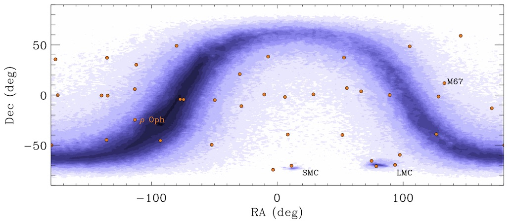

# 2MASS-Cal-PSWDB-Periods
Periodic objects discovered in the [2MASS Calibration Scan Working Database](http://www.ipac.caltech.edu/2mass/releases/allsky/doc/seca4_1.html), by James R. A. Davenport, Andrew C. Becker, Peter Plavchan, Roc Cutri.

This work supported by NASA ADP grant NNX09AC77G

*Positions of the 40 fields in the Cal-PSWDB (orange circles). Contours show the density of 1 million random point sources from the main 2MASS catalog*